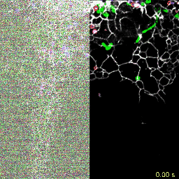
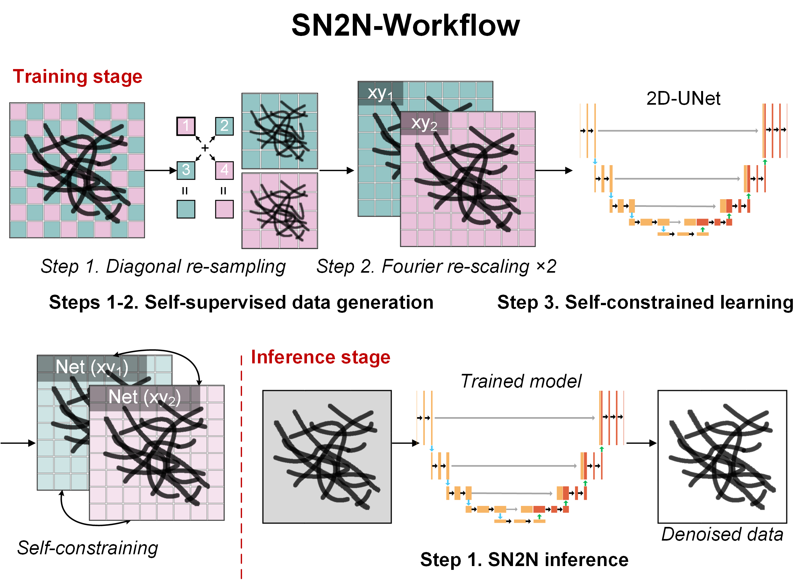

[](https://github.com/WeisongZhao/SN2N/)
[](https://github.com/WeisongZhao/SN2N/releases/tag/v0.1.0/)
[](https://github.com/WeisongZhao/SN2N/blob/master/LICENSE/)
[](https://www.nature.com/nmeth/)
[](https://github.com/WeisongZhao/SN2N/releases/tag/v0.1.0/)<br>

[](https://twitter.com/weisong_zhao)
[](https://twitter.com/QuLiying)
[](https://github.com/WeisongZhao/SN2N/) 


<p>
<h1 align="center"><font color="#FF6600">S</font>N2N</h1>
<h5 align="center">Self-inspired learning to denoise for live-cell super-resolution microscopy.</h5>
<h6 align="right">v0.1.0</h6>
</p>
<br>


<p>

</p>
<br>


This repository is for our developed self-inspired Noise2Noise (SN2N) learning-to-denoise engine, and it will be in continued development. It is distributed as accompanying software for publication: [Liying Qu et al. Self-inspired learning to denoise for live-cell super-resolution microscopy, XXX (2024)](https://www.nature.com/nmeth/). Please cite SN2N in your publications, if it helps your research.

<br><br><br>

<div align="center">

✨ [**Introduction**](#-Introduction) **|**  🔧 [**Install**](#-Installation)  **|** 🎨 [**Data-generation**](#-Data_generation) **|**  💻 [**Training**](#-Training) **|** ⚡ [**Inference**](#-Inference) **|** &#x1F308; [**Related-links**](#-Related_links)

</div>

---

## Introduction

<p>

</p>

Our SN2N is fully competitive with the supervised learning methods and overcomes the need for large dataset and clean ground-truth. **First**, we create a self-supervised data generation strategy based on super-resolution images' spatial redundancy, using a diagonal resampling step followed by a Fourier interpolation for single-frame Noise2Noise. **Second**, we have taken a step further by ushering in a self-constrained learning process to enhance the performance and data-efficiency. **Finally**, we provide a Patch2Patch data augmentation (random patch transformations in multiple dimensions) to further improve the data efficiency.


## 🔧 Installation

### Tested platform
  - Python = 3.7.6, Pytorch = 1.12.0 (`Win 10`, `128 GB RAM`, `NVIDIA RTX 4090 24 GB`, `CUDA 11.6`)

### Dependencies 
  - Python >= 3.6
  - PyTorch >= 1.10
    
### Instruction

1. Clone the repository.

    ```bash
    git clone https://github.com/WeisongZhao/SN2N.git
    cd SN2N    
    ```

2. Create a virtual environment and install PyTorch and other dependencies. Please select the correct Pytorch version that matches your CUDA version from [https://pytorch.org/get-started/previous-versions/](https://pytorch.org/get-started/previous-versions/). 

    Users can set up the environment directly by installing the packages listed in the (**requirements.txt**) file. The packages required by the environment have also been uploaded to the requirements.

    ```bash
    $ conda create -n SN2N python=3.7.6
    $ conda activate SN2N
    
    $ pip install requirement.txt
    ```

## 🎨Data generation

### 1. Self-supervised data generation
Our SN2N is adaptable to both 2D (**xy**) and 3D (**xyz**) datasets. You can use your own data or our uploaded to generate 2D / 3D SN2N data pairs. 

Users can run the script after customizing parameters in Script_SN2N_datagen_2D.py (Script_SN2N_datagen_3D.py) or run directly from the command line.

#### 2D data generation
```bash
	python Script_SN2N_datagen_2D.py --img_path "Users own path/data" --P2Pmode "1" --P2Pup "1" --BAmode "1" --SWsize "64"        
```

#### 3D data generation
```bash
 	python Script_SN2N_datagen_3D.py --img_path 'Users own path/data' --P2Pmode '1' --P2Pup '1' --BAmode '1' --SWsize '64'    
```

#### Parameters instructions

The key parameters for 2D data generation and 3D data generation are consistent. There are also other parameters that do not require user modification. Detailed explanations can be found in the SN2N.get_options.datagen2D / SN2N.get_options.datagen3D function. 

```bash
    -----Parameters------
    =====Important==========
    img_path:
        Path of raw images to train.
    P2Pmode(0 ~ 3):
        Augmentation mode for Patch2Patch.
        0: NONE; 
        1: Direct interchange in t;
        2: Interchange in single frame;
        3: Interchange in multiple frame but in different regions;
        {default: 0}
    P2Pup:
        Increase the dataset to its (1 + P2Pup) times size.
        {default: 0}
    BAmode(0 ~ 2):
        Basic augmentation mode.
        0: NONE; 
        1: double the dataset with random rotate&flip;
        2: eightfold the dataset with random rotate&flip;
        {default: 0} 
    SWsize:
        Interval pixel of sliding window for generating image pathes.
        {default: 64}
        
    ======Other parameters do not require modification; ======
    ======for details, refer to SN2N.get_options.========
    
```

## 💻 Training 

### 1. Prepare the data  

You can use SN2N data pairs for SN2N learning

### 2. Start training

Users can run the script after customizing parameters in Script_SN2N_trainer_2D.py (Script_SN2N_trainer_3D.py) or run directly from the command line.

#### 2D data training

```bash
    python Script_SN2N_trainer_2D.py --img_path "Users own path/data" --sn2n_loss "1" --bs "32" --lr "2e-4" --epochs "100"
```

#### 3D data training

```bash
	python Script_SN2N_trainer_2D.py --img_path "Users own path/data" --sn2n_loss "1" --bs "32" --lr "2e-4" --epochs "100" 
```

#### Parameters instructions

The key parameters for 2D trainer and 3D trainer are consistent. There are also other parameters that do not require user modification. Detailed explanations can be found in the SN2N.get_options.trainer2D/ SN2N.get_options.trainer3D function.

```bash
    -----Parameters------
    =====Important==========
    img_path:
        Path of raw images to train.
    sn2n_loss:
        Weight of self-constrained loss.
        {default: 1}
    bs:
        Training batch size.
        {default: 32}
    lr:
        Learning rate
        {default: 2e-4}.
    epochs:
        Total number of training epochs.
        {default: 100}.
        
    ======Other parameters do not require modification; ======
    ======for details, refer to SN2N.get_options.========
    
```

## ⚡ Inference
### 1. Prepare models

Before inference, you should have trained your own model

### 2. Test models

Users can run the script after customizing parameters in Script_SN2N_inference_2D.py (Script_SN2N_inference_3D.py) or run directly from the command line.

#### 2D inference

  ```bash
	python Script_SN2N_inference_2D.py --img_path "Users own path/data"
  ```

#### 3D inference
In 3D prediction tasks, we use the method of stitching predictions to avoid issues of memory overflow

  ```bash
    python Script_SN2N_inference_2D.py --img_path "Users own path/data"
  ```

#### Parameters instructions

The key parameters for 2D inference and 3D inference are consistent. There are also other parameters that do not require user modification. Detailed explanations can be found in the SN2N.get_options.Predict2D/ SN2N.get_options.Predict3D function.

```bash
    -----Parameters------
    img_path:
        Path of raw images to inference
        
    ======Other parameters do not require modification; ======
    ======for details, refer to SN2N.get_options.========
    
```

## Version

- v0.2.8  version of SN2N

## Related_links: 

- **Some fancy results and comparisons:** [Lab's website](https://weisongzhao.github.io/MyWeb2/portfolio-4-col.html)
- **Preprint:** [Liying Qu et al. Self-inspired learning to denoise for live-cell super-resolution microscopy, bioRxiv (2024).]()


## Open source [SN2N](https://github.com/WeisongZhao/SN2N)
This software and corresponding methods can only be used for **non-commercial** use, and they are under Open Data Commons Open Database License v1.0.